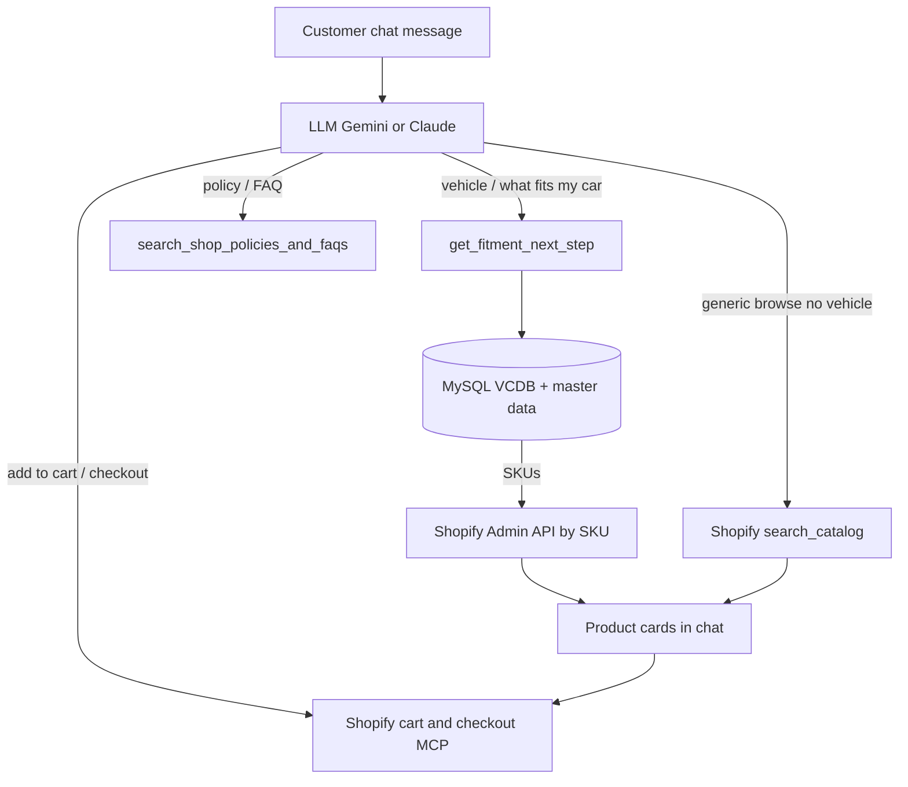
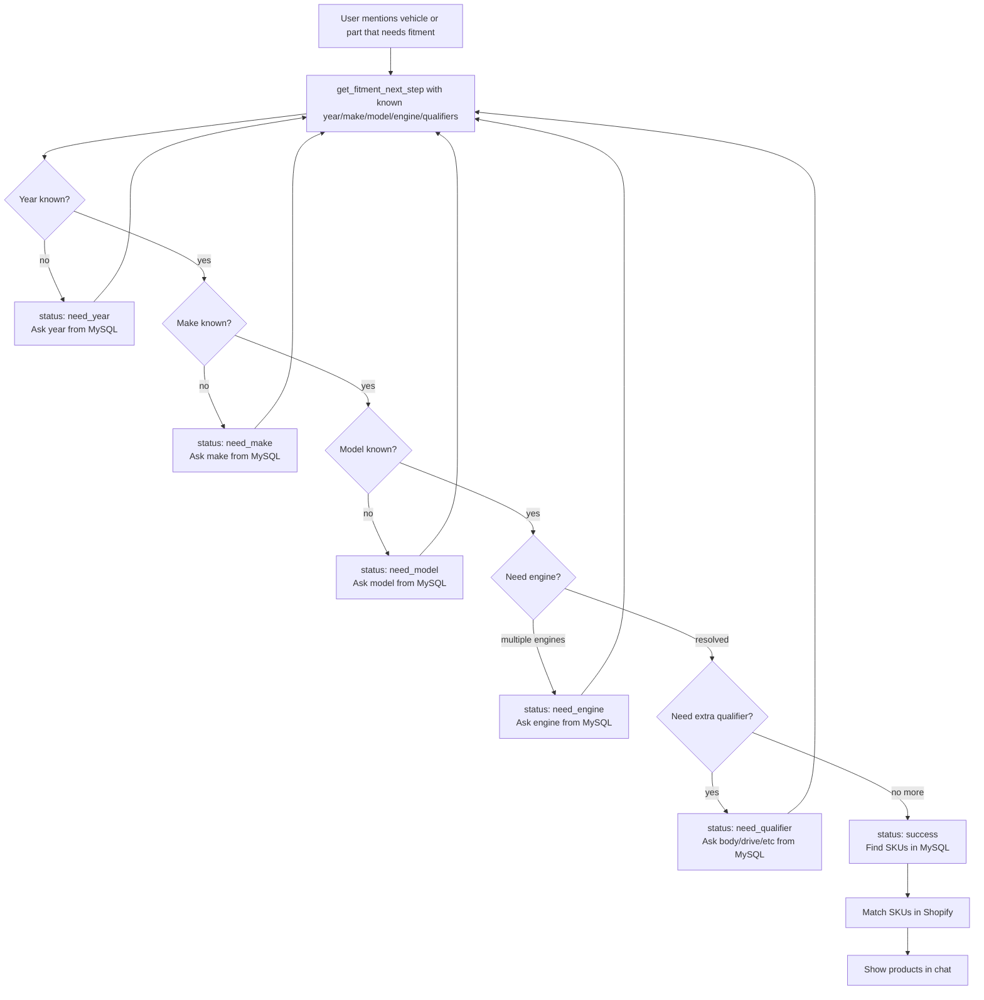
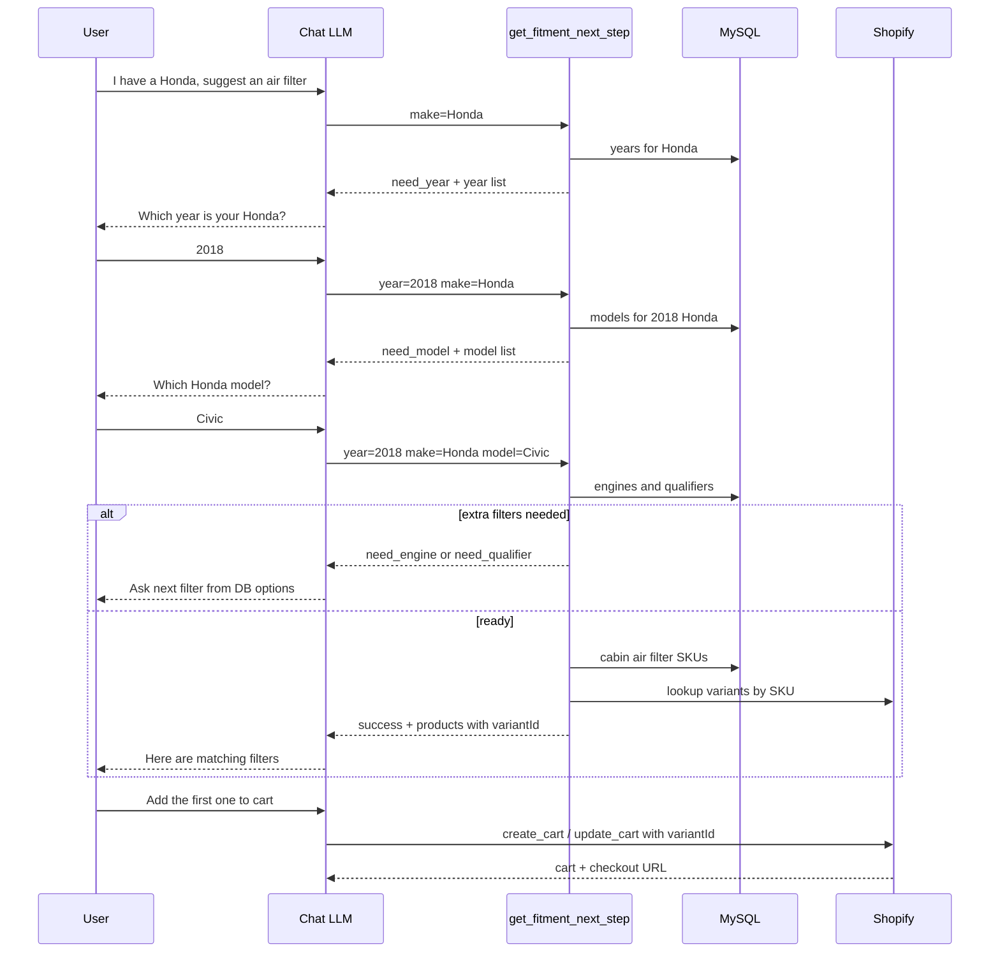
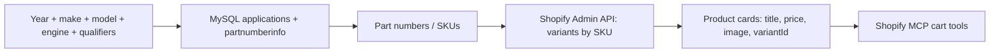
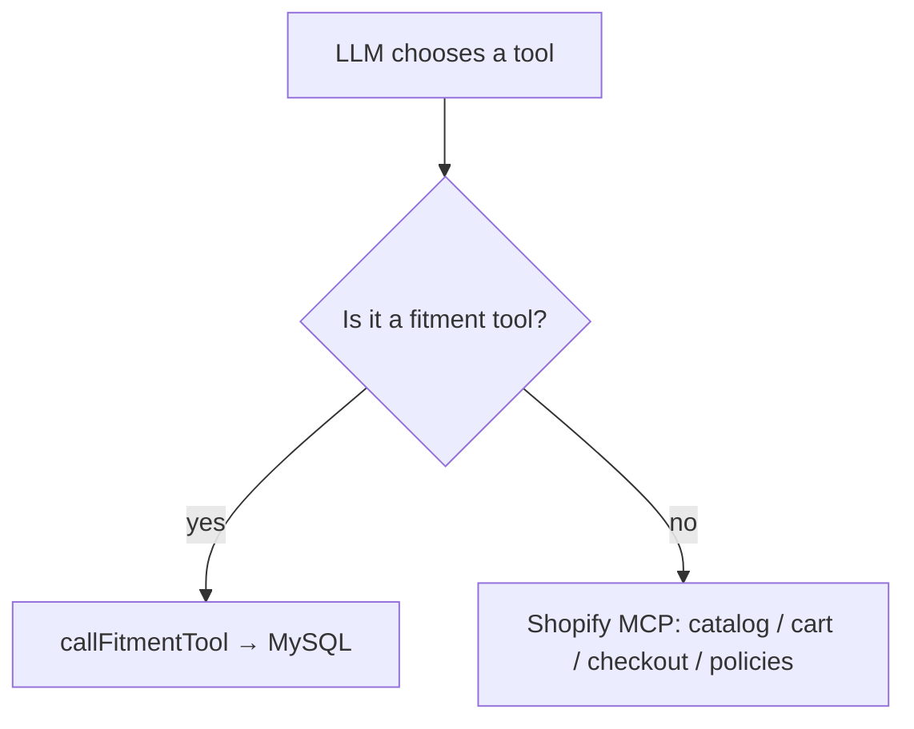

# Product suggestion logic

This app has **two product-search paths**. Vehicle fitment uses **MySQL**. Generic browsing uses **Shopify MCP catalog**. Cart and checkout always stay on Shopify.

## High-level architecture



## Which path is used?

| Customer asks | Tool used | Data source |
|---|---|---|
| “I have a Honda, suggest an air filter” | `get_fitment_next_step` | **MySQL filters** |
| “2008 Ford Escape” | `get_fitment_next_step` | **MySQL filters** |
| “What fits my car?” | `get_fitment_next_step` | **MySQL filters** |
| “Search for t-shirts / snowboards” | `search_catalog` | Shopify catalog, **not MySQL** |
| “What is your return policy?” | `search_shop_policies_and_faqs` | Shopify MCP |
| “Add this to cart” | `create_cart` / `update_cart` | Shopify MCP |

For vehicle questions, the prompt tells the LLM **not** to use `search_catalog`. It must call `get_fitment_next_step` first.

## Fitment filter flow (MySQL)

The chat asks filters **one by one**. Each step runs a MySQL query and returns DB-backed options.



### Status meanings

| Status | What the chat asks next |
|---|---|
| `need_year` | Vehicle year |
| `need_make` | Make, for example Honda |
| `need_model` | Model, for example Civic |
| `need_engine` | Engine, only if more than one matches |
| `need_qualifier` | Extra option from DB, for example body style |
| `success` | Show matching products |
| `not_found` | No matching part |

## Example conversation



## What happens after filters are complete



1. MySQL finds **cabin air filter SKUs** for that vehicle.
2. Shopify Admin API turns those SKUs into live products (`variantId`, price, handle).
3. Chat shows the products.
4. Add to cart uses Shopify MCP, **not** MySQL.

## Databases used for fitment

Configured in `.env` when `FITMENT_ENABLED=true`.

| Pool | Typical DB | Purpose |
|---|---|---|
| `DB_HOST_1` | VCDB | Years, makes, models, engines |
| `DB_HOST_3` | Master data | Applications, part numbers, images, qualifiers |
| Shopify Admin API | Store catalog | Live price, variant, product URL |

## Fitment tools (custom, not Shopify MCP)

| Tool | Role |
|---|---|
| `get_fitment_next_step` | **Main tool.** Ask next filter or return products |
| `lookup_fitment_years` | List years |
| `lookup_fitment_makes` | List makes for a year |
| `lookup_fitment_models` | List models for year + make |
| `lookup_fitment_engines` | List engines |
| `get_fitment_qualifier` | Next extra qualifier |
| `find_fitment_products` | Same end result as next-step when data is complete |

The LLM is instructed to use **`get_fitment_next_step` only** for vehicle questions.

## How chat routes tools



This is in `app/routes/chat.jsx`:

- Fitment tool names go to `app/fitment/`
- Everything else goes to Shopify MCP

## How to confirm in logs

Vehicle suggestion using MySQL:

```text
Calling tool: get_fitment_next_step with arguments: {"make":"Honda"}
Fitment tools enabled: 7
```

Generic Shopify catalog (no MySQL):

```text
Calling tool: search_catalog ...
```

Wrong path for a vehicle question:

```text
Calling tool: search_shop_policies_and_faqs ...
```

If you see the last one for “Honda air filter”, the LLM skipped the fitment DB.

## Summary

- **Vehicle product suggestion** = MySQL filter wizard (`year → make → model → engine → qualifier → SKUs`) then Shopify for live product/cart.
- **Generic catalog search** = Shopify `search_catalog` only. It does **not** run your MySQL queries.
- **Cart / checkout** = always Shopify MCP.
